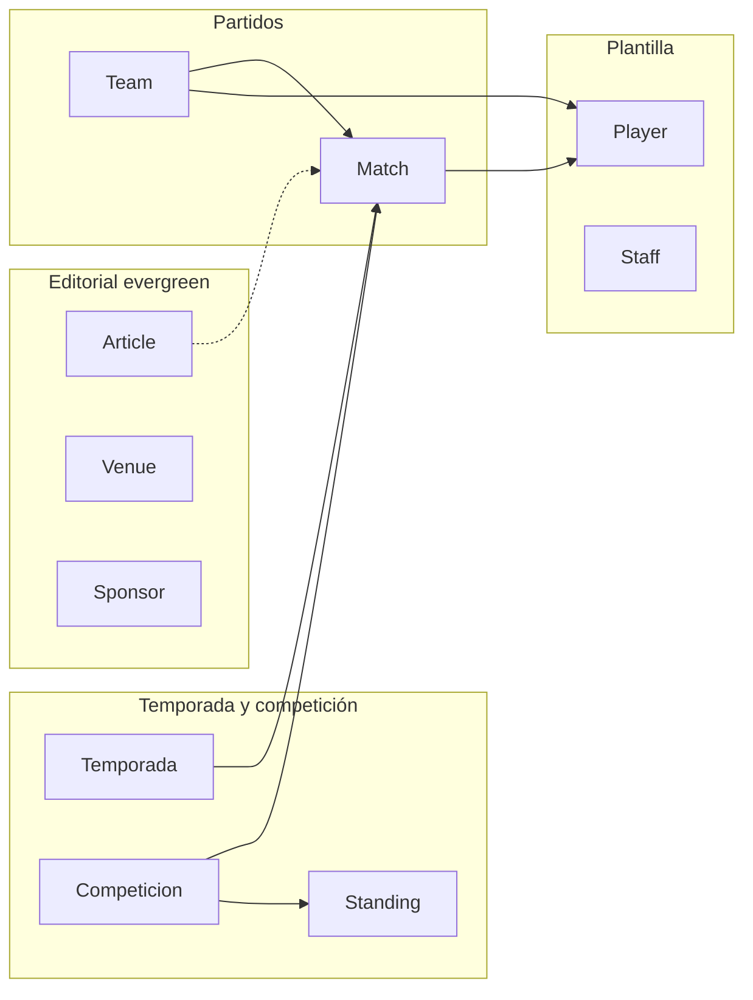

# Plan de proyecto: Bogota FC (arquitectura web)

**Fuente:** [interBogota-fc-requeriment.md](./interBogota-fc-requeriment.md)

**Alcance acordado:** estructura del proyecto, IA, modelo de datos y comportamiento por plantilla — **sin** diseño visual, copies, wireframes, UI kit, backlog detallado ni cronogramas.

---

## Checklist de seguimiento (alto nivel)

- [ ] Definir stack (frontend SSR, CMS headless, origen datos deportivos) antes de scaffolding del repo
- [ ] MVP: rutas y plantillas según tabla de IA + navegación del requerimiento
- [ ] MVP: modelar tipos CMS/API (sección 3); semillas para temporadas, competiciones, partidos, plantilla
- [ ] MVP: metas, sitemap, robots, schema base; criterios a11y mínimos en tablas y media
- [ ] V1/V2: match center avanzado, i18n, fans/login, live y personalización según fases del requerimiento

---

## 1. Principios rectores

- **Evergreen vs temporada:** contenido institucional (Club, legal, sponsors estáticos) separado conceptualmente de datos deportivos (temporada, competición, partidos, plantilla, clasificación).
- **Hubs por entidad:** cada `Jugador`, `Partido`, `Competición` y `Noticia` como URL canónica estable; filtros por temporada/competición en query o estado de URL, no duplicando rutas frágiles.
- **Conversión externa:** ticketing y e-commerce vía `proveedor_checkout_url` en MVP; evitar scope de checkout propio hasta V2 según el documento.

---

## 2. Arquitectura de información → rutas y plantillas

Mapear el sitemap (secciones 1–2 del requerimiento) a **tipos de plantilla** reutilizables:

| Plantilla | Rutas ejemplo (convención) | Notas |
| --------- | -------------------------- | ----- |
| Home | `/` | Bloques: hero próximo partido, resultados, noticias, tabla, CTAs entradas/tienda/video, sponsors, newsletter |
| Listado partidos | `/partidos/calendario`, `/partidos/resultados` | Filtros temporada, competición, local/visita |
| Detalle partido | `/partidos/[slug]` | Tabs: resumen, stats, alineaciones, minuto a minuto, galería/video, entradas |
| Plantilla equipo | `/equipo/primer-equipo`, `/equipo/femenino`, `/equipo/cantera` | Filtros posición, dorsal, nacionalidad |
| Perfil jugador / staff | `/equipo/.../jugador/[slug]`, `/equipo/.../staff/[slug]` | Datos del modelo `Player` / `Staff` |
| Hub competición | `/competicion/[slug]` | Selector temporada, tabla, calendario torneo, stats, enlaces a partidos |
| Noticias / detalle | `/noticias`, `/noticias/[categoria]`, `/noticias/[slug]` | Comunicados como variante o ruta `/noticias/comunicados` |
| Media | `/media/videos`, `/media/fotos`, detalle video/galería | Taxonomías por temporada/competición/tipo |
| Entradas | `/entradas`, `/entradas/partido/[matchId]`, abonos, info estadio | `TicketProduct` + CTAs |
| Tienda | `/tienda`, categorías, `/tienda/producto/[slug]` | `ShopProduct` |
| Club / Fans / Sponsors / Academy / Legal | Slugs CMS bajo `/club/...`, `/fans`, `/sponsors`, `/academy`, `/legal/...` | Principalmente bloques editoriales + listados donde aplique |
| Utilidades | `/buscar`, `404`, `500`, selector idioma | Búsqueda con tabs por tipo de resultado |

**Navegación:** implementar el header/footer y secundaria tal como en la sección **4** del requerimiento (*Navegación*), alineando labels con las rutas anteriores para no divergir menú y URL.

---

## 3. Capa de datos y CMS

- **Implementar primero** los modelos de la sección 3 del requerimiento como contrato de API/CMS: `Temporada`, `Competicion`, `Team`, `Match`, `Player`, `Staff`, `Standing` (tabla), `Article`, comunicados (extensión de `Article`), `MediaAsset`, `Video`, `Galeria`, `Venue`, `TicketProduct`, `ShopProduct`, `Sponsor`, `MembershipPlan`, `FanEvent`, más `Config`/taxonomías.
- **Taxonomías controladas** desde el inicio (`categorias_noticias`, posiciones, roles staff, etc.) para filtros y búsqueda coherente.
- **Contenido modular:** `biografia_bloques`, `body_bloques`, `descripcion_bloques` alineados con un sistema de bloques reutilizables en CMS (sin definir UI).
- **Relaciones clave:** `Match` → competición, temporada, estadio, alineaciones, eventos, stats; `Article` → relacionados, media destacada; `Video`/`Galeria` → `related_match_id` opcional.

---

## 4. Fases de entrega (alineadas al documento)

**MVP**

- CMS: noticias, media básica, páginas institucionales.
- Calendario, resultados, detalle de partido **básico** (marcador, contexto, tabs mínimos o una sola vista ampliada incrementalmente).
- Plantilla y perfiles jugador/staff.
- Clasificación por competición.
- Entradas y tienda: catálogo + CTA a URLs externas.
- Búsqueda simple.
- SEO técnico base: metas, `sitemap.xml`, `robots.txt`, schema básico (equipo, partido, noticia, video según sección 6 del requerimiento).

**V1**

- Match center ampliado: stats comparativas, alineaciones, eventos, minuto a minuto.
- Selectores temporada/competición persistentes (cookie o URL state).
- Media con taxonomías robustas.
- i18n (UI + contenido localizable).
- Newsletter opt-in y alertas.
- Módulo Fans/membresía con login opcional.
- Analytics + gestión de consentimiento (cookies).

**V2**

- Live match center en tiempo real.
- Cuenta fan con preferencias y personalización de home.
- Integración profunda ticketing/e-commerce si el proveedor lo permite.
- Contenido histórico/evergreen ampliado.
- Automatización de relacionados y workflows editoriales avanzados.

---

## 5. Requisitos transversales (sección 6 del requerimiento)

- **SEO:** schema para equipo, partido, noticia, video; hubs con enlazado interno.
- **Accesibilidad:** teclado, focus, tablas con headers, `alt` en media.
- **Rendimiento:** priorizar home y detalle partido; lazy-load en media secundaria; caching con revalidación para datos que cambian en partido.
- **i18n:** formatos fecha/moneda/terminología por región (preparar modelo y CMS, despliegue fuerte en V1).

---

## 6. Decisión de stack (fuera del PDF; recomendación para ejecutar)

El documento no fija tecnología. Para concretar implementación en un siguiente paso, elegir explícitamente:

- **Frontend:** framework SSR/SSG (p. ej. Next.js) para SEO y páginas críticas, o equivalente.
- **CMS:** headless (Sanity, Strapi, Contentful, etc.) o CMS del propio backend, con los modelos anteriores como colecciones/tipos.
- **Datos deportivos:** seed manual/API mock en MVP; integración real en fases posteriores si aplica.

Este plan no bloquea la elección; el MVP puede empezar con datos mock + CMS editorial.

---

## Sobre este archivo

`plan-cursor.md` es la copia consolidada del plan de arquitectura en la raíz del proyecto (curso / sitio), derivada de `interBogota-fc-requeriment.md`.
